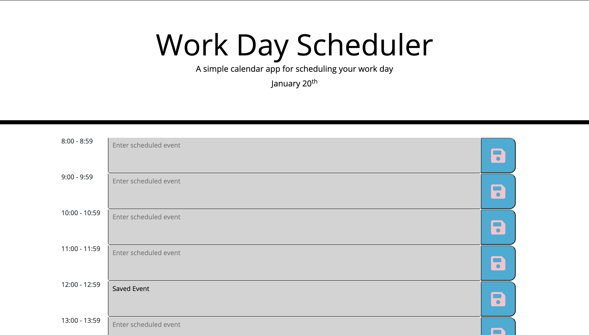

# Day-Planner

A day by day calender that will allow you to organize your schedule by the hour. Time is presented in military time. Time sections are color coded for past (grey), present (red), and future (green) text areas. Enter text in a box during an hour you have something planned and hit the save button on the right side. 

Information is saved in localStorage.

Save icons are taken from fontawesome.com.

Planner uses html, css, javascript, jquery, localStorage (to store saved events), and luxon (for time application).

Site: https://nmp14.github.io/Day-Planner/

